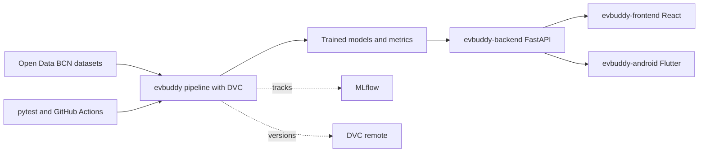

<p align="center">
  
</p>

<h1 align="center">EVBuddy</h1>

<p align="center">
  <a href="pyproject.toml"></a>
  <a href="dvc.yaml"></a>
  <a href=".github/workflows"></a>
</p>

EVBuddy is a reproducible ML pipeline for forecasting EV charging-station availability.
It combines data engineering, feature pipelines, distributed model training, experiment tracking, and CI automation.

## Live Application

Web frontend is currently available at:

- https://evbuddy.diogomsmiranda.com

## End-to-End System Scheme

High-level architecture:



Detailed architecture and stage-level flow:

- `docs/ARCHITECTURE.md`

Repository roles:

- `evbuddy`: data ingestion, feature engineering, training, evaluation, DVC/CI orchestration.
- `evbuddy-backend`: serves trained model artifacts for prediction and geocoding/routing-facing endpoints.
- `evbuddy-frontend`: browser UI for map, station availability, and route-oriented interaction.
- `evbuddy-android`: mobile Flutter client with map, station clusters, and directions flow.

## Why this project

- Build a reproducible end-to-end pipeline from raw EV station snapshots to trained models.
- Version data and models with DVC so results can be reproduced from Git commits.
- Train horizon-specific classifiers (10m, 20m, 30m) and track quality over time.

## Tech Stack

- Data & features: `pandas`
- Scalable training flow: `dask` + `distributed`
- Models: `xgboost`
- Metrics & evaluation: `scikit-learn`
- Reproducibility: `dvc`
- Environment/deps: `poetry`
- Testing/contracts: `pytest`, `pytest-cov`, `pandera`
- Experiment tracking: `mlflow`
- CI automation: GitHub Actions

Detailed pipeline stages, model artifact outputs, and MLflow runtime configuration are documented in:

- `CONTRIBUTIONS.md`

## Quick Start

Install dependencies:

```bash
poetry env use python3.12
poetry install --with dev
```

Configure DVC remote URL in local-only config (private runner / maintainers):

```bash
poetry run dvc remote add --force --local local "<your-dvc-remote-url>"
```

If you have access to the DVC remote, pull tracked data/artifacts:

```bash
poetry run dvc pull
```

Run pipeline:

```bash
poetry run dvc repro
```

Run specific stages:

```bash
poetry run dvc repro visualisation
poetry run dvc repro train_models
```

## Public Reproducibility Note

- This repository is public, but the current DVC remote is private.
- `dvc pull` requires remote access credentials.
- Without remote access, full reproduction requires obtaining the raw input datasets independently and placing them under the expected `data/raw` paths used by `dvc.yaml`.

## CI Workflows

- `ci.yml`: syntax + tests
- `dvc.yml`: DVC repro jobs (PR-scoped jobs plus full repro on `main`)

## Contributing

Contribution process, branch strategy, and PR checklist are documented in:

- `CONTRIBUTIONS.md`
- Includes training modes, testing commands, DVC stages, and MLflow setup.

## Data Attribution and License

This product or service uses data from the [Open Data BCN portal](https://opendata-ajuntament.barcelona.cat/en).

Source of the data: [Barcelona City Council](https://barcelona.cat/opendata).

License: [Creative Commons Attribution 4.0 (CC BY 4.0)](https://creativecommons.org/licenses/by/4.0/).

Data has been transformed and adapted in this project (feature engineering, model training, and prediction generation).

This attribution does not imply endorsement by Barcelona City Council of this application or its outputs.

## Model Artifact License Scope

Only the predictive model artifacts under `models/` are licensed under a non-commercial license:

- [Creative Commons Attribution-NonCommercial 4.0 (CC BY-NC 4.0)](https://creativecommons.org/licenses/by-nc/4.0/)

This scope applies to model files (for example `models/xgb_occupied_h10m.json`, `models/xgb_occupied_h20m.json`, `models/xgb_occupied_h30m.json`) and related derived model outputs in `models/`.
