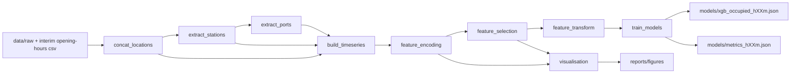

# EVBuddy

EVBuddy is a reproducible ML pipeline for EV charging-station availability forecasting.
It uses:

- `poetry` for dependency management
- `dvc` for data/model pipeline orchestration and artifact tracking
- `pytest` for unit/integration/quality tests

The main training implementation is Dask + XGBoost (`src/models/train_models.py`) for better memory behavior on larger datasets.

## Project Structure

```text
src/
  data/            # raw/interim data processing
  features/        # feature engineering and dense time-grid transform
  models/          # model training (Dask main, pandas baseline script)
  visualisation/   # diagnostics and plots
data/
  raw/             # DVC-tracked raw source snapshots
  interim/         # pipeline intermediate datasets
  processed/       # dense 10-minute modeling dataset
models/            # trained models + metrics JSON
reports/figures/   # generated visual diagnostics
tests/             # unit, integration, quality tests
dvc.yaml           # pipeline stages
dvc.lock           # frozen stage hashes
```

## End-to-End Pipeline

Defined in `dvc.yaml`:

1. `concat_locations`
2. `extract_stations`
3. `extract_ports`
4. `build_timeseries`
5. `feature_encoding`
6. `feature_selection`
7. `visualisation`
8. `feature_transform`
9. `train_models` (Dask/XGBoost)

### Pipeline Diagram



### What each stage does

- `concat_locations`: merges raw location CSV snapshots.
- `extract_stations` / `extract_ports`: flattens nested location payload into normalized station/port tables.
- `build_timeseries`: builds station-level temporal records and engineered availability fields.
- `feature_encoding`: one-hot encodes categorical columns.
- `feature_selection`: drops zero-variance numeric features (keeps `snapshot_ts`).
- `visualisation`: produces sparsity/distribution/dimensionality plots.
- `feature_transform`: converts station observations to a dense 10-minute grid with freshness/time features and stale handling.
- `train_models`: trains 10/20/30-minute horizon classifiers and writes model + metric artifacts.

## Setup

### 1) Install dependencies

```bash
poetry install --with dev
```

### 2) Configure Python environment

```bash
poetry env use python3.12
```

### 3) Configure DVC remote (example)

Current repo default in `.dvc/config` is a local remote named `local`.
If needed:

```bash
poetry run dvc remote modify --local local url "<your-dvc-remote-url>"
```

## Running the Pipeline

### Pull required artifacts

Pull the raw DVC-tracked data:

```bash
poetry run dvc pull data/raw.dvc
```

Or pull everything available in cache:

```bash
poetry run dvc pull
```

### Reproduce full pipeline

```bash
poetry run dvc repro -f
```

### Run specific stages

```bash
poetry run dvc repro visualisation
poetry run dvc repro train_models
```

## Training Variants

- Main pipeline trainer: `src/models/train_models.py` (Dask + `xgboost.dask`)
- Baseline trainer script: `src/models/train_models_pandas.py` (pandas + classic XGBoost)

Run pandas baseline manually:

```bash
poetry run python -m src.models.train_models_pandas
```

Useful env vars for Dask trainer:

- `EV_BUDDY_DASK_N_WORKERS` (default: `3`)
- `EV_BUDDY_DASK_THREADS_PER_WORKER` (default: based on CPU count)

Useful env var for feature memory profiling:

- `EV_BUDDY_FUNCTION_MEMORY_PROFILE=1` enables function-level memory profiling in `feature_transform`.

## Tests

Run full suite:

```bash
poetry run pytest -v
```

Coverage is enabled via `pyproject.toml` (`--cov=src --cov-report=term-missing`).

Quality gate for model metrics:

```bash
poetry run pytest -v tests/quality/test_metrics_thresholds.py
```

## CI / GitHub Actions

- `.github/workflows/ci.yml`: syntax + test workflow
- `.github/workflows/dvc.yml`: DVC reproduction workflow (self-hosted runner)

Typical DVC CI flow:

1. Checkout
2. Install Python + Poetry + deps
3. Configure DVC remote
4. `dvc pull`
5. `dvc repro ...`
6. Metrics quality gate

## Troubleshooting

Usually `dvc.yaml` and `dvc.lock` are out of sync (stage outputs changed, lock not refreshed).

Fix:

```bash
poetry run dvc repro <changed-stage>
poetry run dvc push
git add dvc.lock dvc.yaml
git commit -m "sync dvc lock"
```

### Dask worker memory restarts / `KilledWorker`

Reduce concurrency:

```bash
EV_BUDDY_DASK_N_WORKERS=1 EV_BUDDY_DASK_THREADS_PER_WORKER=1
```
