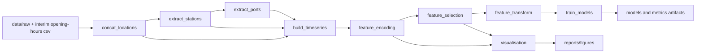

# EVBuddy

[](pyproject.toml)
[](dvc.yaml)
[](.github/workflows)

EVBuddy is a reproducible ML pipeline for forecasting EV charging-station availability.
It combines data engineering, feature pipelines, distributed model training, experiment tracking, and CI automation.

## Why this project

- Build a reproducible end-to-end pipeline from raw EV station snapshots to trained models.
- Version data and models with DVC so results can be reproduced from Git commits.
- Train horizon-specific classifiers (10m, 20m, 30m) and track quality over time.

## Pipeline at a Glance



## Tech Stack and Usage

| Technology | Where | Why it is used |
|---|---|---|
| `pandas` | feature scripts, preprocessing | Tabular data transformation and feature engineering. |
| `dask` + `distributed` | `src/models/train_models.py` | Larger-than-memory friendly processing and distributed training data flow. |
| `xgboost` | model training | Binary classification for station occupancy risk at future horizons. |
| `scikit-learn` | metrics/evaluation | AUC, logloss-adjacent diagnostics, precision/recall/F1/balanced accuracy. |
| `dvc` | `dvc.yaml`, `dvc.lock`, artifact store | Reproducible stage orchestration and data/model versioning. |
| `poetry` | `pyproject.toml` | Dependency and virtual environment management. |
| `pytest` + `pytest-cov` + `pandera` | `tests/` | Unit tests, coverage checks, and data contract/schema validation. |
| `mlflow` | training stage logging | Experiment tracking for params, metrics, and model artifacts. |
| GitHub Actions | `.github/workflows/` | CI checks and DVC pipeline execution on self-hosted runner. |

## DVC Stages

From `dvc.yaml`:

1. `concat_locations`
2. `extract_stations`
3. `extract_ports`
4. `build_timeseries`
5. `feature_encoding`
6. `feature_selection`
7. `visualisation`
8. `feature_transform`
9. `train_models`

Outputs include:
- dense processed dataset in `data/processed`
- horizon models in `models/xgb_occupied_h10m.json`, `models/xgb_occupied_h20m.json`, `models/xgb_occupied_h30m.json`
- horizon metrics in `models/metrics_h10m.json`, `models/metrics_h20m.json`, `models/metrics_h30m.json`

## MLflow Tracking

Training runs can be logged to MLflow via `MLFLOW_TRACKING_URI`.

- Local runner endpoint commonly used: `http://127.0.0.1:5000`
- This project is configured so tracking is reachable only through a private network path (VPN / protected tunnel), not as a public open endpoint.

Optional environment variables:
- `MLFLOW_TRACKING_URI`
- `MLFLOW_EXPERIMENT_NAME` (default: `evbuddy-train-models`)

## Quick Start

Install dependencies:

```bash
poetry env use python3.12
poetry install --with dev
```

Configure DVC remote URL in local-only config:

```bash
poetry run dvc remote add --force --local local "<your-dvc-remote-url>"
```

Pull data and run pipeline:

```bash
poetry run dvc pull
poetry run dvc repro
```

Run specific stages:

```bash
poetry run dvc repro visualisation
poetry run dvc repro train_models
```

## Training Modes

- Main trainer: `src/models/train_models.py` (Dask + XGBoost)
- Baseline trainer: `src/models/train_models_pandas.py` (pandas)

Run baseline manually:

```bash
poetry run python -m src.models.train_models_pandas
```

## Testing

Run all tests:

```bash
poetry run pytest -v
```

Quality gate for model metrics:

```bash
poetry run pytest -v tests/quality/test_metrics_thresholds.py
```

## CI Workflows

- `ci.yml`: syntax + tests
- `dvc.yml`: DVC repro jobs (PR-scoped jobs plus full repro on `main`)

## Troubleshooting

If `dvc.yaml` and `dvc.lock` diverge:

```bash
poetry run dvc repro <stage-name>
poetry run dvc push
git add dvc.yaml dvc.lock
git commit -m "sync dvc lock"
```

If Dask workers hit memory limits:

```bash
EV_BUDDY_DASK_N_WORKERS=1 EV_BUDDY_DASK_THREADS_PER_WORKER=1 poetry run dvc repro train_models
```
