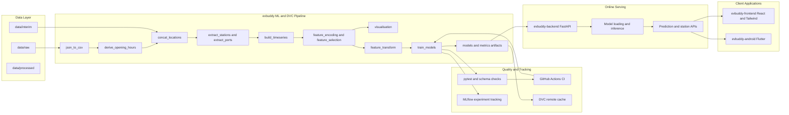

# EVBuddy Architecture

This page contains the full end-to-end architecture and stage-level flow for the EVBuddy ecosystem.

## Stage Output Materialization

- `json_to_csv`: writes `data/raw/opendata_datasets_csv` from `data/raw/opendata_datasets_json`.
- `derive_opening_hours`: writes `data/interim/oh_opendata_datasets_csv` from raw CSV snapshots.
- `concat_locations`: writes `data/interim/locations.csv` from raw and interim source CSV files.
- `extract_stations` and `extract_ports`: write `data/interim/stations.csv` and `data/interim/ports.csv`.
- `build_timeseries` and feature stages: write CSV artifacts under `data/interim/features/`.
- `feature_transform`: writes `data/processed/dense_10min.parquet` by default, with CSV fallback if Parquet dependencies are unavailable.
- DVC versioning follows `dvc.yaml` stage `outs` declarations rather than every individual file-write call.
- Raw dataset ownership:
  - `data/raw/opendata_datasets_json` is Git-tracked as canonical source snapshots.
  - `data/raw/opendata_datasets_csv` is DVC-tracked as derived conversion/cache input for pipeline stages.
