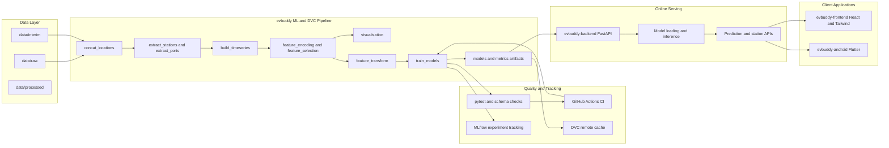

# EVBuddy Architecture

This page contains the full end-to-end architecture and stage-level flow for the EVBuddy ecosystem.

```mermaid
flowchart LR
  subgraph DataLayer[Data Layer]
    R1[data/raw]
    R2[data/interim]
    R3[data/processed]
  end

  subgraph MLPipeline[evbuddy ML and DVC Pipeline]
    P1[concat_locations]
    P2[extract_stations and extract_ports]
    P3[build_timeseries]
    P4[feature_encoding and feature_selection]
    P5[visualisation]
    P6[feature_transform]
    P7[train_models]
    P8[models and metrics artifacts]
  end

  subgraph QualityAndTracking[Quality and Tracking]
    Q1[pytest and schema checks]
    Q2[GitHub Actions CI]
    Q3[MLflow experiment tracking]
    Q4[DVC remote cache]
  end

  subgraph Serving[Online Serving]
    S1[evbuddy-backend FastAPI]
    S2[Model loading and inference]
    S3[Prediction and station APIs]
  end

  subgraph Clients[Client Applications]
    C1[evbuddy-frontend React and Tailwind]
    C2[evbuddy-android Flutter]
  end

  R1 --> P1
  R2 --> P1
  P1 --> P2 --> P3 --> P4 --> P6 --> P7 --> P8
  P4 --> P5
  P8 --> S1 --> S2 --> S3
  S3 --> C1
  S3 --> C2

  P7 --> Q3
  P8 --> Q4
  P7 --> Q1
  Q1 --> Q2
  Q2 --> P7
```
